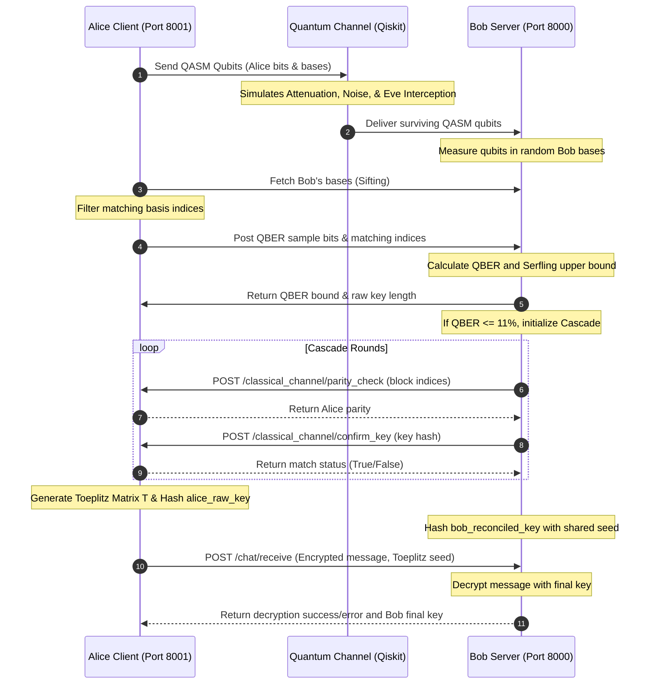

# Quantum Key Distribution Simulation and Visualizer

A realistic simulation and step-by-step visualizer of the BB84 Quantum Key Distribution protocol. The system models physical channel behaviors, including fiber attenuation, depolarization noise, detector efficiency, and dark counts, and implements distributed Cascade error reconciliation and Toeplitz-based privacy amplification.

## Protocol Architecture and Flow

The simulation orchestrates the interaction between two classical network nodes, Alice and Bob, communicating over both a simulated quantum channel and a classical HTTP channel.

### 1. Quantum State Preparation and Transmission
Alice generates random bits and encodes them into quantum states using randomly selected bases (Z-basis or X-basis). These states are compiled into Qiskit QASM strings and passed through the quantum channel model.

### 2. Quantum Channel Model
The channel simulates real-world optical fiber characteristics:
* Eavesdropping: Eve intercepts a configurable fraction of the qubits, measures them in random bases, collapses their state, and re-sends them.
* Fiber Attenuation: Photons are lost exponentially according to fiber distance and attenuation coefficients.
* Detector Efficiency: Bob's photodiode efficiency limits photon registration.
* Dark Counts: Random thermal counts trigger fake photon detections at Bob's station.

### 3. Sifting
Bob measures the surviving photons using his own randomly selected bases. Alice and Bob classically compare their bases. Only indices where their bases match are retained, forming the raw sifted key.

### 4. QBER Verification
Alice publicly shares a 20 percent sample of the matching bits. Bob computes the Quantum Bit Error Rate (QBER) and applies the Serfling upper bound to determine if the channel is secure. If the QBER bound exceeds the 11 percent safety threshold, the protocol aborts.

### 5. Distributed Cascade Reconciliation
Bob runs the Cascade reconciliation protocol to correct bit mismatches caused by channel noise. Rather than sharing keys, Bob executes local bisection searches and queries Alice's parity check endpoint over the classical channel. Key convergence is verified by comparing SHA-256 hashes of the keys.

### 6. Privacy Amplification
Both parties apply a Toeplitz matrix hash over GF(2) to compress the reconciled key down to a final secret key. This removes the information leaked to Eve during QBER checks and Cascade parity checks. The final key is hashed via SHA-256 to initialize an AES cipher (Fernet) for message encryption.



---

## Component Details

### 1. alice_client.py
Coordinates the orchestration of the protocol simulation.
* Exposes the main `/initialize_connection` endpoint which initiates the run.
* Exposes `/classical_channel/parity_check` to return the XOR parity of specific bit index subsets of Alice's raw key.
* Exposes `/classical_channel/confirm_key` to receive Bob's key hash and compare it with the SHA-256 hash of Alice's key.
* Computes the final Toeplitz hash, encrypts the secret message, and forwards it to Bob.

### 2. bob_server.py
Acts as the receiving node and runs the error-correcting steps.
* Exposes `/quantum_channel/receive` to receive and measure qubits using Qiskit Aer simulation.
* Exposes `/classical_channel/bases` to share sifting configurations.
* Exposes `/classical_channel/check_qber` to verify QBER bounds and execute the Cascade protocol.
* Exposes `/chat/receive` to receive the encrypted payload, derive the final key using the shared Toeplitz parameters, and attempt decryption.

### 3. channel_model.py
Models physical quantum transmission behavior:
* Simulates Eve's intercept-resend attack with configurable probability.
* Calculates channel transmissivity: `T = 10^(-(\alpha * d) / 10)` where `\alpha = 0.2` dB/km (fiber loss) and `d` is distance.
* Computes overall photon survival probability combined with detector efficiency.
* Injects random dark counts and depolarization noise.

### 4. cascade.py
Implements the distributed error correction and hashing math:
* Cascade Class: Conducts multi-pass reconciliation using binary search bisections and backtracking. Interacts exclusively via callbacks to avoid direct raw key access.
* `generate_toeplitz_matrix`: Generates the binary matrix of size M × N from a shared seed.
* `toeplitz_hash`: Computes the GF(2) matrix-vector product T · x (mod 2).
* `serfling_upper_bound`: Calculates the statistical upper bound on the true error rate.

### 5. qkd-visualizer (Frontend)
A Next.js single-page application that visualizes the steps:
* Parameters Panel: Configures simulation values (Distance, Depolarization, Eve Intercept, Detector Efficiency, and Epsilon).
* Step Tables: Displays detailed bit-by-bit matrices representing Alice's state prep, Eve's intercept measurements, Bob's measurements, and the sifting comparisons.
* QBER Gauge: Animates the QBER Bound alongside raw QBER and the safety threshold.
* Final Key view: Shows the step-by-step progression of the key (Raw -> Reconciled -> Secret Final Key). Renders the full matrix equation T · x (mod 2) = y showing only boundary rows/columns with mathematical ellipsis styling for dense configurations.
---

## Tech Stack and Prerequisites

| Component | Technology | Version |
|---|---|---|
| Backend | Python | 3.12 |
| Quantum Simulator | Qiskit / Qiskit-Aer | 1.1.1 / 0.14.2 |
| API Framework | FastAPI / Uvicorn | 0.111.0 / 0.30.1 |
| Cryptography | Fernet (Cryptography) | 42.0.7 |
| Frontend | React / Next.js / TypeScript | 14.2 / 5.4 |
| Styling | Tailwind CSS | 3.4.1 |

---

## Installation and Setup Instructions

### Backend Setup
1. Create a Python virtual environment:
   ```bash
   python -m venv .venv
   source .venv/bin/activate
   ```
2. Install dependencies:
   ```bash
   pip install -r requirements.txt
   ```
3. Start Bob's server:
   ```bash
   python bob_server.py
   ```
4. Start Alice's client:
   ```bash
   python alice_client.py
   ```

### Frontend Setup
1. Navigate to the visualizer directory:
   ```bash
   cd qkd-visualizer
   ```
2. Install dependencies:
   ```bash
   npm install
   ```
3. Start the Next.js development server:
   ```bash
   npm run dev
   ```

### Running with Docker Compose
To run the entire system (Alice, Bob, and Caddy proxy) inside containers:
```bash
docker compose up -d --build
```

---

## Usage Examples and API Endpoints

### 1. Initialize Connection (Alice)
* Endpoint: `POST http://localhost:8001/initialize_connection`
* Request Payload:
  ```json
  {
    "num_bits": 3000,
    "is_eve": true,
    "distance_km": 10.0,
    "depolarization_rate": 0.02,
    "eve_intercept_prob": 1.0,
    "detector_efficiency": 0.85,
    "epsilon": 0.2
  }
  ```

### 2. Quantum Channel Receive (Bob)
* Endpoint: `POST http://localhost:8000/quantum_channel/receive`
* Request Payload:
  ```json
  {
    "qasm_strings": ["OPENQASM 2.0; ..."],
    "received_indices": [0, 1, 2],
    "depolarization_rate": 0.02
  }
  ```

### 3. Parity Check Callback (Alice)
* Endpoint: `POST http://localhost:8001/classical_channel/parity_check`
* Request Payload:
  ```json
  {
    "block_indices": [0, 1, 5, 8]
  }
  ```
* Response Payload:
  ```json
  {
    "parity": 1
  }
  ```

### 4. Key Confirmation Callback (Alice)
* Endpoint: `POST http://localhost:8001/classical_channel/confirm_key`
* Request Payload:
  ```json
  {
    "bob_key_hash": "a591a6d40bf420404a011733cfb7b190d62c65bf0bcda32b57b277d9ad9f146e"
  }
  ```
* Response Payload:
  ```json
  {
    "match": true
  }
  ```
